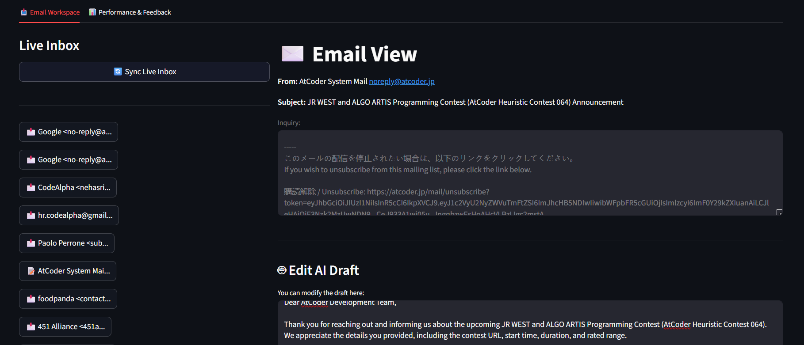
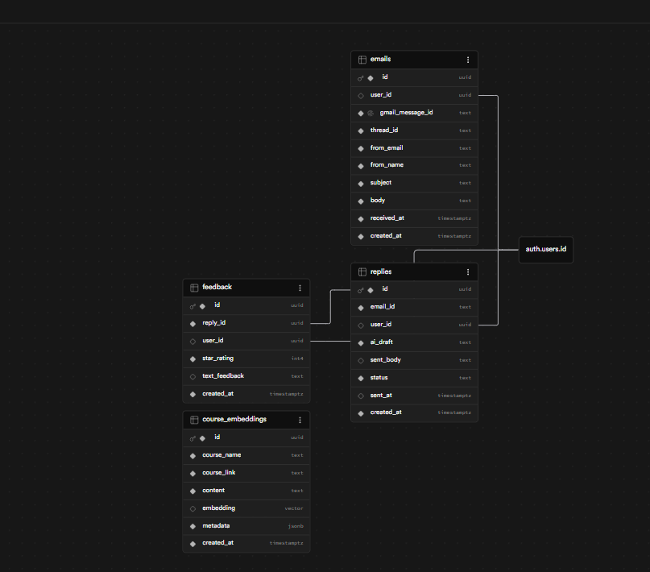
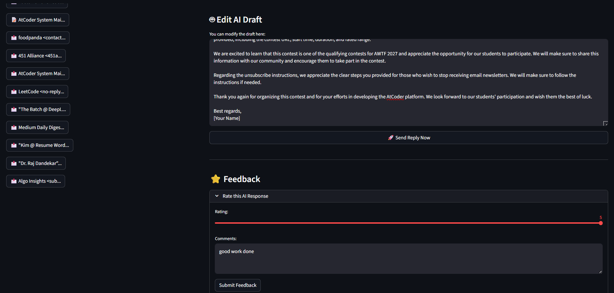
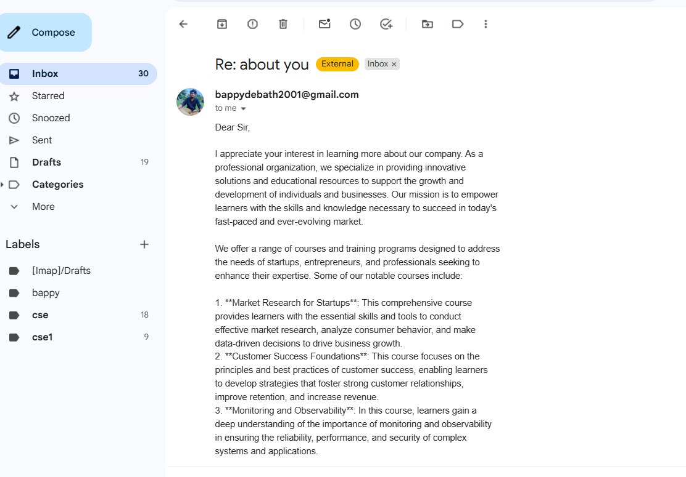
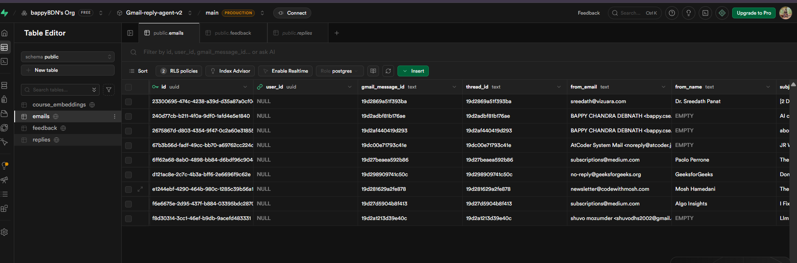

# Vizuara AI Agent

An AI-powered email assistant for Vizuara that helps manage student inquiries, generate responses using RAG and LLMs, and track performance.

## ⚙️ How It Works (Architecture & Workflow)

This application follows a **Human-in-the-Loop (HITL)** AI architecture, ensuring high-quality, contextual responses while continuously improving the AI model through human feedback.

Here is the step-by-step workflow:

### 1. 📥 Email Ingestion (Google API)
The system securely connects to your Gmail inbox using the Gmail API. It constantly monitors for new client inquiries and fetches the incoming emails into the workspace.
 ### 2. 🧠 AI Generation via RAG & LLM
Once an email arrives, the system analyzes the context. It uses a **Retrieval-Augmented Generation (RAG)** pipeline to search our Supabase vector database for relevant company knowledge, previous responses, or course details. The LLM (Llama 3 via Groq) then drafts a highly contextual reply based on this retrieved data.
 ### 3. 🧑‍💻 Human-in-the-Loop & Rating System
Before anything is sent, a human operator reviews the AI-generated draft. 
* The operator can edit the draft if needed.
* The operator provides a **Star Rating (1-5)** and text feedback on the AI's generation quality. This rating is saved to the database to refine and improve future AI prompts.
 ### 4. 🚀 Dispatching the Email
Once the draft is approved and the rating is submitted, the operator clicks "Send". The application uses the Gmail API to send the finalized email directly to the client, seamlessly continuing the email thread.
 ### 5. 📊 Performance & Analytics Tracking
The system features an analytics dashboard that tracks the overall performance of the AI Agent. It visualizes the total inquiries, the number of automated drafts, and the average human satisfaction rating over time.
 <br>
*Database structure mapping the feedback loop:*
 

## Features

- Live Gmail inbox synchronization
- AI-generated responses using Groq (Llama 3) and Sentence Transformers
- RAG (Retrieval-Augmented Generation) with Supabase vector store
- Feedback collection system
- Email sending capabilities
- Analytics dashboard

## Setup

1. Clone the repository
2. Create a `.env` file with the following variables:
   ```
   NEXT_PUBLIC_SUPABASE_URL=your_supabase_url
   SUPABASE_SERVICE_ROLE_KEY=your_supabase_service_role_key
   GROK_API_KEY=your_groq_api_key
   ```
   Note: Never commit your `.env` file to version control.

3. Install dependencies:
   ```bash
   pip install -r requirements.txt
   pip install streamlit groq google-auth google-auth-oauthlib google-api-python-client sentence-transformers supabase python-dotenv pandas
   ```

4. Set up Gmail API credentials:
   - Follow the [Gmail API quickstart](https://developers.google.com/gmail/api/quickstart/python)
   - Save the token as `token.json` in the project root

5. Run the application:
   ```bash
   streamlit run app.py
   ```
   or
   ```bash
   python -m streamlit run app.py
   ```

## Project Structure

- `app.py`: Main Streamlit application
- `gmail_sender.py`: Gmail sending functionality
- `fetch_emails.py`: Email fetching utilities
- `generate_reply.py`: Reply generation logic
- `setup_knowledge_base.py`: Script to initialize the Supabase vector store
- `requirements.txt`: Python dependencies

## Environment Variables

The following environment variables are required:
- `NEXT_PUBLIC_SUPABASE_URL`: Supabase project URL
- `SUPABASE_SERVICE_ROLE_KEY`: Supabase service role key
- `GROK_API_KEY`: Groq API key (for Llama 3 model)

## Data Privacy

This application processes email data locally and only sends AI-generated replies. No email content is stored permanently outside of your Supabase instance (if used for RAG) and feedback database.

## License
